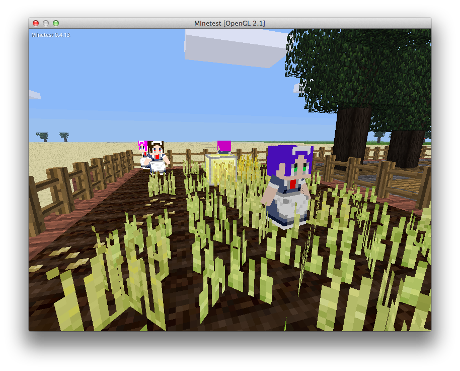

# Maidroid
Maidroid is a mod for Minetest which adds maid robots that can perform common tasks such as farming and cutting down trees.

## Dependencies
* default
* dye

## Forum Topic
The forum topic for this mod on the Minetest Forums is located at:

* https://forum.minetest.net/viewtopic.php?f=9&t=14808

## License
The source code of Maidroid is available under the [GPLv3](https://www.gnu.org/licenses/gpl-3.0.html) or later license.

The resouces included in Maidroid are available under the [CC-BY-SA 4.0](https://creativecommons.org/licenses/by-sa/4.0/) or later license.

---

## `maidroid/maidroid_tool`

### Core Writer

